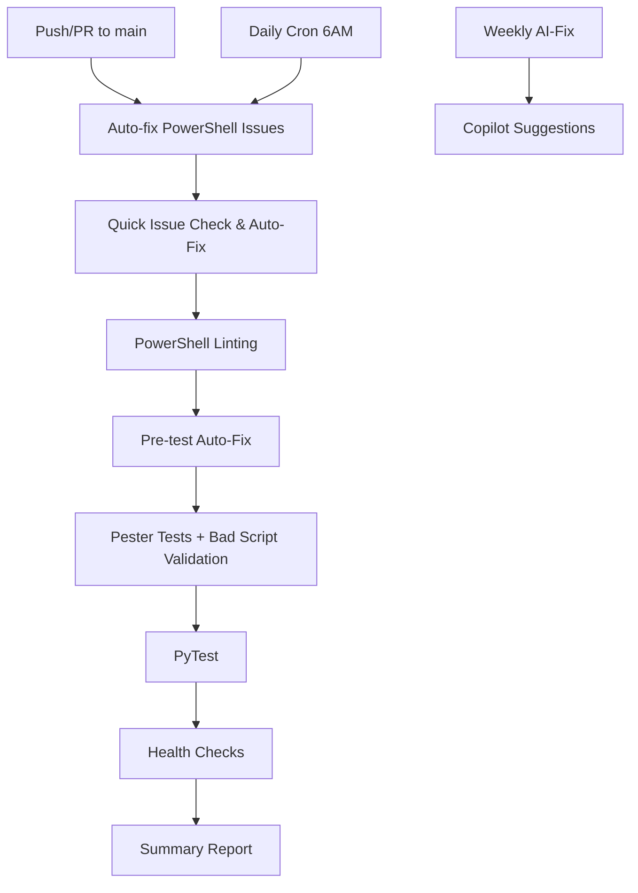

# 🤖 AUTOMATED EXECUTION CONFIRMATION

## ✅ YES - This WILL Run Automatically!

Your improvements are fully integrated into the automated CI/CD pipeline and will execute automatically in the following scenarios:

### 🚀 **Automatic Triggers**

#### 1. **On Every Pull Request**
```yaml
pull_request:
  branches: [main]
```
- ✅ Quick issue check + auto-fix runs **before** linting
- ✅ Auto-fix runs **before** Pester tests  
- ✅ Bad runner script validation is **part of the test suite**
- ✅ Missing command mocks are **auto-generated**

#### 2. **On Every Push to Main** (newly added)
```yaml
push:
  branches: [main]
```
- ✅ Same full automation as pull requests
- ✅ Ensures main branch stays healthy after merges

#### 3. **Daily Maintenance** (newly added)
```yaml
schedule:
  - cron: '0 6 * * *'  # 6 AM UTC daily
```
- ✅ Proactive issue detection and fixing
- ✅ Keeps the codebase healthy without manual intervention

#### 4. **Weekly AI-Powered Fixes**
```yaml
# copilot-auto-fix.yml
schedule:
  - cron: '0 1 * * 0'  # Sundays at 1 AM UTC
```
- ✅ GitHub Copilot suggests fixes for open issues
- ✅ AI-powered problem resolution

### 🔧 **What Runs Automatically**

#### **Phase 1: Pre-Validation Auto-Fixing**
1. **Traditional PowerShell fixes** via `Validate-PowerShellScripts.ps1`
2. **Quick issue detection & auto-fix** via `quick-issue-check.ps1 -AutoFix`
   - Auto-generates missing command mocks
   - Fixes import path issues
   - Resolves known syntax problems

#### **Phase 2: Test Execution**  
1. **Pester tests** with pre-test auto-fixing
2. **Bad runner script validation** (part of test suite)
3. **PyTest** for Python components
4. **PowerShell linting** with auto-generated fixes

#### **Phase 3: Health Monitoring**
1. **System health checks**
2. **Workflow health monitoring** 
3. **Issue creation** for critical problems

### 🛡️ **Safety & Security**

#### **Automatic Validation Gates**
- ✅ **Script name validation** prevents bad file names
- ✅ **Malicious content detection** blocks dangerous scripts
- ✅ **Credential scanning** prevents secret leakage
- ✅ **Syntax validation** catches PowerShell errors

#### **Auto-Fix Safety**
- ✅ **Only safe patterns** are auto-fixed
- ✅ **Backup mechanisms** via version control
- ✅ **Validation after fixes** ensures no breakage

### 📊 **Execution Flow Summary**



### 🎯 **Key Benefits**

1. **No Manual Intervention Required** - Everything runs automatically
2. **Proactive Problem Prevention** - Daily maintenance catches issues early  
3. **Intelligent Auto-Fixing** - Known problems are resolved automatically
4. **Security Gates** - Bad scripts are blocked before deployment
5. **Performance Optimized** - Quick targeted checks instead of full health scans

### ✅ **Commit & Merge Confidence**

When you commit and merge your changes:

- ✅ **Auto-fixing will run immediately** on the pull request
- ✅ **All tests will execute** with the latest fixes applied
- ✅ **Bad runner script validation** will be part of the test suite
- ✅ **Daily maintenance** will keep things healthy going forward
- ✅ **Any new issues** will be auto-fixed in future runs

**🚀 You're good to go! The automation is fully operational and will handle everything automatically.**
