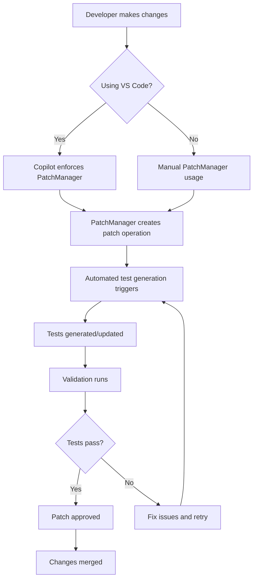

# CoreApp Automated Testing and Validation Workflow

## Overview

This document describes the comprehensive automated testing and validation workflow implemented for the OpenTofu Lab Automation core app. The system enforces PatchManager usage for all changes and provides continuous test generation and execution.

## 🎯 Objectives

1. **Enforce PatchManager Usage**: All file changes by AI agents must go through PatchManager
2. **Continuous Test Generation**: Automatically generate Pester and pytest tests for new features
3. **Robust Validation**: Comprehensive testing with tiered validation levels
4. **Cross-Platform Support**: Ensure compatibility across Windows, Linux, and macOS
5. **VS Code Integration**: Seamless development workflow with integrated testing

## 🏗️ Architecture

### Core Components

1. **CoreApp Module** (`pwsh/core_app/`)
   - Main application logic and scripts
   - Cross-platform PowerShell 7.0+ compatible
   - Modular design with individual script components

2. **PatchManager Integration** (`pwsh/modules/PatchManager/`)
   - Enforced workflow for all changes
   - Tiered testing with different failure impacts
   - Rollback capabilities and change tracking

3. **Automated Test Generation** (`scripts/Invoke-AutomatedTestGeneration.ps1`)
   - Monitors core app for changes
   - Automatically generates Pester tests
   - Validates test coverage and quality

4. **VS Code Configuration** (`.vscode/`)
   - Copilot instructions enforce PatchManager usage
   - Tasks for test generation and execution
   - Snippets for standardized development patterns

## 🔄 Workflow Process

### 1. Development Phase

When working on core app features:



### 2. Continuous Integration

GitHub Actions automatically:

1. **Monitors Changes**: Triggers on core app modifications
2. **Generates Tests**: Runs automated test generation
3. **Executes Validation**: Runs comprehensive test suite
4. **Reports Results**: Provides coverage and quality metrics
5. **Enforces Standards**: Validates PatchManager usage

### 3. Test Generation Logic

The automated test generation system:

```powershell
# Monitor for changes
./scripts/Invoke-AutomatedTestGeneration.ps1 -Mode Monitor

# Generate tests for new/modified scripts
./scripts/Invoke-AutomatedTestGeneration.ps1 -Mode Generate

# Validate coverage and execute tests
./scripts/Invoke-AutomatedTestGeneration.ps1 -Mode All
```

## 📋 Test Categories

### Critical Tests (Tier 1)
- **Impact**: Failures block builds/merges
- **Scope**: Core functionality, syntax validation, module loading
- **Examples**: 
  - PowerShell syntax validation
  - Module import verification
  - Cross-platform compatibility

### Important Tests (Tier 2)
- **Impact**: Failures warn but don't block
- **Scope**: Feature functionality, integration tests
- **Examples**:
  - Function parameter validation
  - Error handling verification
  - Performance benchmarks

### Maintenance Tests (Tier 3)
- **Impact**: Informational only
- **Scope**: Code quality, optimization opportunities
- **Examples**:
  - Code style consistency
  - Documentation completeness
  - Optimization suggestions

## 🛠️ Tools and Commands

### VS Code Tasks

Access via Command Palette (`Ctrl+Shift+P`) → "Tasks: Run Task":

- **Generate CoreApp Tests (Automated)**: Creates tests for all core app scripts
- **Monitor CoreApp for Test Generation**: Continuous monitoring mode
- **Run Complete Test Automation**: Full automation cycle
- **Run CoreApp Pester Tests**: Execute existing CoreApp tests

### PowerShell Commands

```powershell
# Import PatchManager (required)
Import-Module "$env:PWSH_MODULES_PATH/PatchManager/" -Force

# Create a new patch operation
$patch = New-PatchOperation -Type 'Modify' -TargetPath './pwsh/core_app/scripts/0007_Install-Go.ps1' -Description 'Add error handling'

# Run tiered tests
Invoke-TieredPesterTests -Tier Critical -BlockOnFailure $true
Invoke-TieredPesterTests -Tier Important -BlockOnFailure $false

# Submit patch for review
Submit-PatchForReview -PatchOperation $patch
```

### Manual Test Generation

```powershell
# Generate tests for specific path
./scripts/Invoke-AutomatedTestGeneration.ps1 -Mode Generate -WatchPath './pwsh/core_app/scripts' -PatchManagerMode

# Validate test coverage
./scripts/Invoke-AutomatedTestGeneration.ps1 -Mode Validate

# Start continuous monitoring
./scripts/Invoke-AutomatedTestGeneration.ps1 -Mode Monitor -MonitorIntervalSeconds 60
```

## 📊 Quality Metrics

### Test Coverage Targets

- **Minimum Coverage**: 80% of core app scripts must have tests
- **Critical Functions**: 100% coverage for installer and configuration scripts
- **Cross-Platform**: All tests must pass on Windows, Linux, and macOS

### Automation Standards

- **PatchManager Usage**: 100% of changes must use PatchManager workflow
- **Test Generation**: New scripts automatically get test coverage within 24 hours
- **Validation Frequency**: Tests run on every push and daily scheduled runs

## 🔧 Configuration Files

### Core App Tests (`tests/CoreApp.Tests.ps1`)

Comprehensive test suite covering:
- Module structure validation
- Script syntax and standards
- Function definition verification
- Cross-platform compatibility
- PatchManager integration

### Automated Generation (`scripts/Invoke-AutomatedTestGeneration.ps1`)

Features:
- AST-based script analysis
- Template-driven test generation
- Continuous monitoring capability
- PatchManager integration
- Coverage reporting

### GitHub Actions (`.github/workflows/coreapp-automated-testing.yml`)

Automated CI/CD pipeline:
- Multi-platform testing
- Automated test generation
- Coverage reporting
- PR commenting with results
- Artifact preservation

## 🎨 VS Code Integration

### Copilot Instructions (`.vscode/copilot-instructions.md`)

Enforces:
- PatchManager usage for all changes
- PowerShell 7.0+ standards
- Cross-platform compatibility
- Proper error handling
- Test-driven development

### Settings (`.vscode/settings.json`)

Configures:
- Code generation standards
- Test generation preferences
- Review selection criteria
- PatchManager enforcement

### Tasks (`.vscode/tasks.json`)

Provides:
- Quick test generation
- Continuous monitoring
- Test execution
- Coverage validation

## 🚀 Getting Started

### Prerequisites

1. **PowerShell 7.0+**: Cross-platform PowerShell
2. **Pester Module**: Testing framework
3. **PatchManager Module**: Change management
4. **VS Code**: Recommended IDE with extensions

### Initial Setup

```powershell
# 1. Set environment variables
$env:PROJECT_ROOT = "C:\path\to\opentofu-lab-automation"
$env:PWSH_MODULES_PATH = "$env:PROJECT_ROOT\pwsh\modules"

# 2. Import required modules
Import-Module "$env:PWSH_MODULES_PATH/PatchManager/" -Force

# 3. Run initial test generation
./scripts/Invoke-AutomatedTestGeneration.ps1 -Mode All -WatchPath './pwsh/core_app'

# 4. Verify setup
Invoke-Pester -Path './tests/CoreApp.Tests.ps1' -Output Detailed
```

### Daily Workflow

1. **Open VS Code**: Copilot automatically enforces standards
2. **Make Changes**: Use PatchManager for all modifications
3. **Monitor Tests**: Background monitoring generates tests automatically
4. **Validate**: Run tests before committing
5. **Review**: Check coverage reports and fix gaps

## 📈 Monitoring and Reporting

### Test Coverage Reports

Generated automatically in:
- `tests/TestCoverage-Report.json`: Detailed coverage metrics
- `coverage/CoreApp-TestReport.json`: Test execution results
- GitHub Actions artifacts: CI/CD run results

### Key Metrics Tracked

- **Coverage Percentage**: % of scripts with tests
- **Test Pass Rate**: Success rate of test executions
- **PatchManager Compliance**: % of changes using proper workflow
- **Cross-Platform Success**: Test success across operating systems

## 🛡️ Enforcement Mechanisms

### PatchManager Requirements

- **VS Code Copilot**: Automatically suggests PatchManager usage
- **GitHub Actions**: Validates PatchManager compliance
- **Pre-commit Hooks**: Can be configured to require PatchManager
- **Code Review**: Templates remind reviewers to check compliance

### Quality Gates

- **Build Blocking**: Critical test failures prevent merges
- **Coverage Thresholds**: Warn when coverage drops below 80%
- **Performance Limits**: Test execution time monitoring
- **Cross-Platform**: All tests must pass on target platforms

## 🔍 Troubleshooting

### Common Issues

1. **Tests Not Generating**: Check file permissions and paths
2. **PatchManager Errors**: Verify module import and environment variables
3. **Cross-Platform Failures**: Review path usage and platform-specific code
4. **Coverage Gaps**: Run validation mode to identify missing tests

### Debug Commands

```powershell
# Check environment
Get-ChildItem Env: | Where-Object Name -match "PROJECT_ROOT|PWSH_MODULES"

# Verify module availability
Get-Module -ListAvailable | Where-Object Name -match "Pester|PatchManager"

# Test script parsing
$errors = $null
[System.Management.Automation.Language.Parser]::ParseFile('./path/to/script.ps1', [ref]$null, [ref]$errors)
$errors

# Manual test execution
Invoke-Pester -Path './tests/CoreApp.Tests.ps1' -Tag 'Critical' -Output Diagnostic
```

## 📚 References

- [PatchManager Documentation](../pwsh/modules/PatchManager/README.md)
- [Pester Testing Framework](https://pester.dev/)
- [PowerShell 7.0+ Documentation](https://docs.microsoft.com/en-us/powershell/)
- [VS Code PowerShell Extension](https://marketplace.visualstudio.com/items?itemName=ms-vscode.PowerShell)

---

**Note**: This workflow is designed to ensure maximum quality and consistency in the OpenTofu Lab Automation project while maintaining developer productivity and enforcing best practices through automation.
